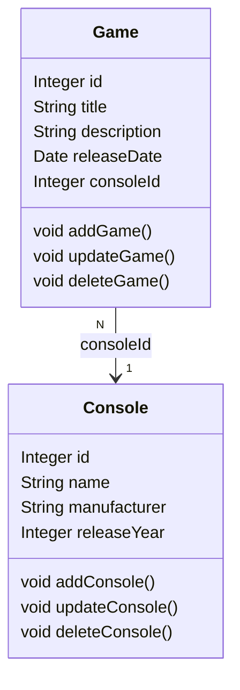

# Games Antigos 2024
Java RESTful API, criada para o desafio de projeto ( Catálogo de jogos antigos ) da DIO. 

## Diagrama de classes

```mermaid
classDiagram
    class Game {
        Integer id
        String title
        String description
        Date releaseDate
        Integer consoleId
        void addGame()
        void updateGame()
        void deleteGame()
    }

    class Console {
        Integer id
        String name
        String manufacturer
        Integer releaseYear
        void addConsole()
        void updateConsole()
        void deleteConsole()
    }

    Game "N" --> "1" Console : consoleId
```
